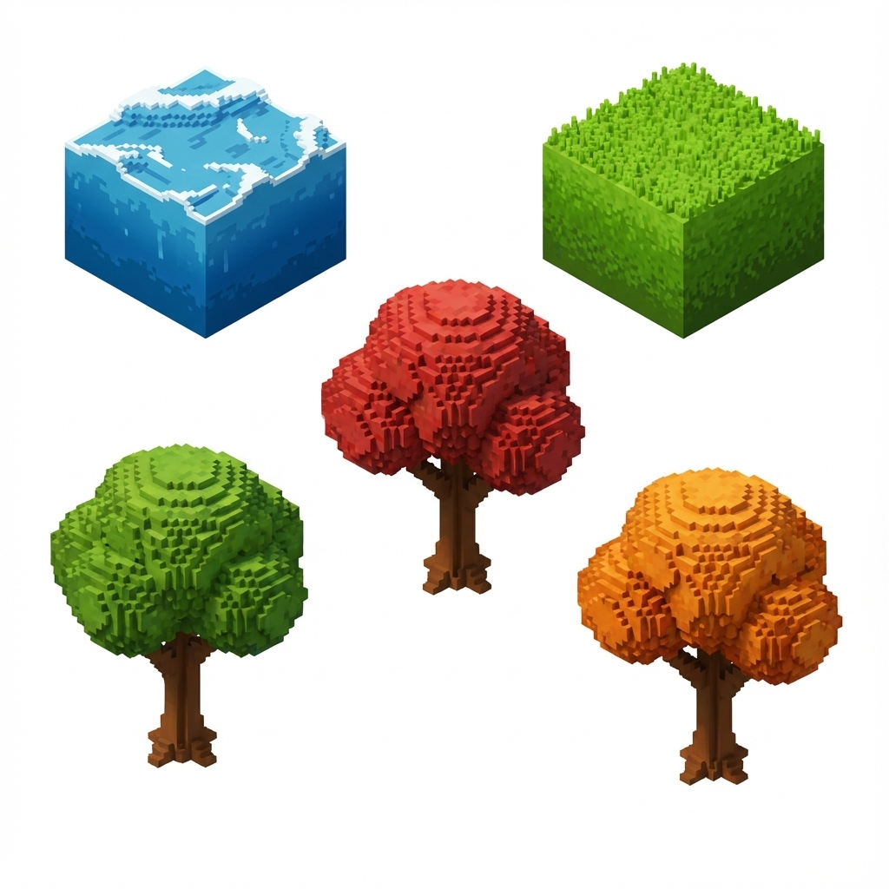
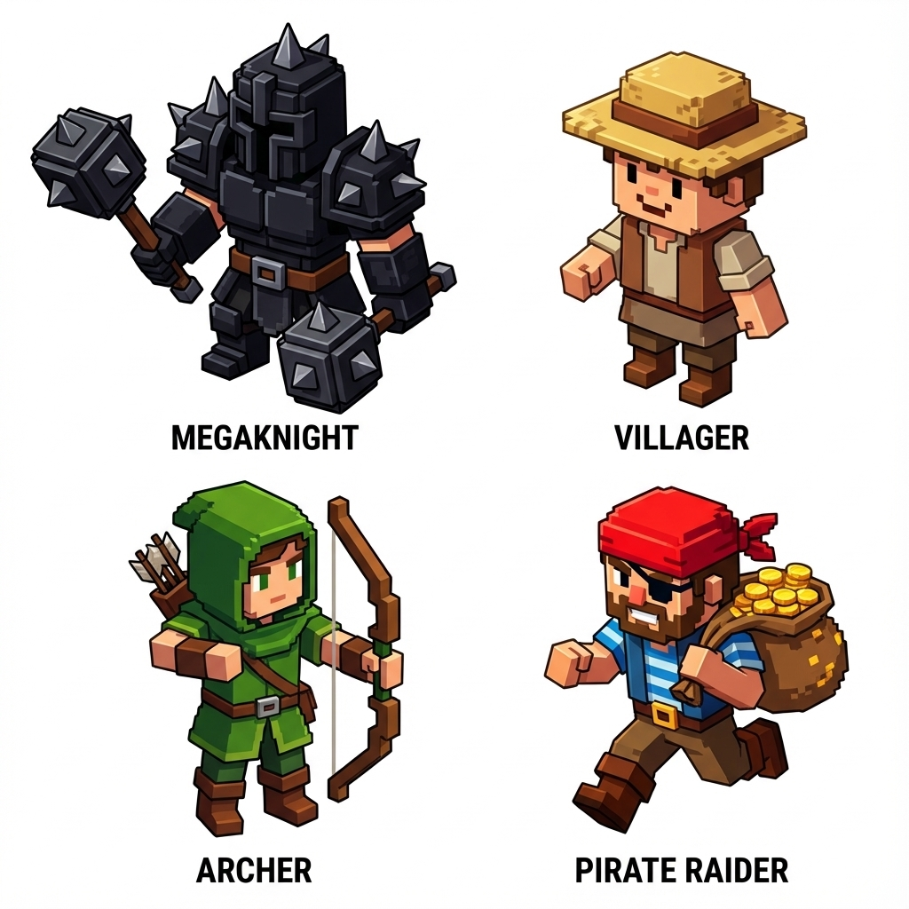
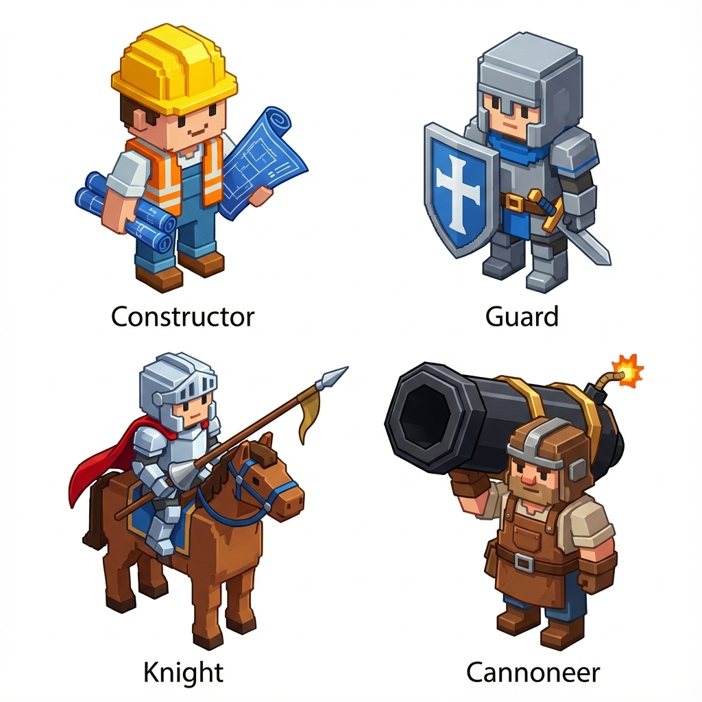
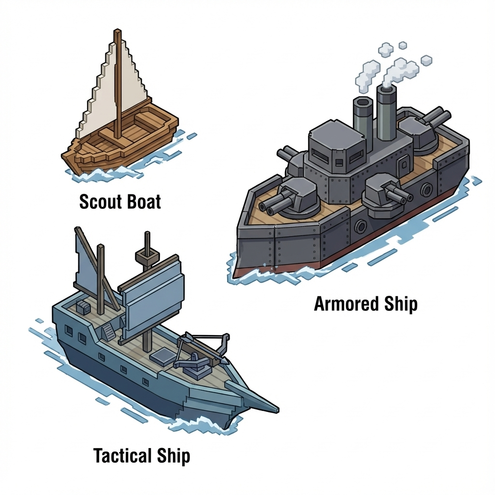
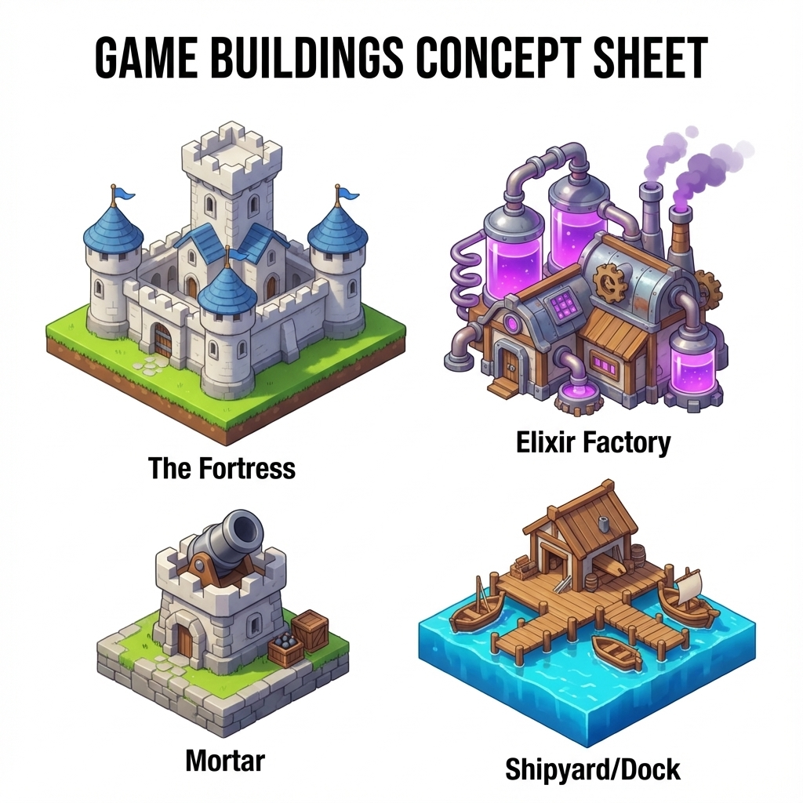
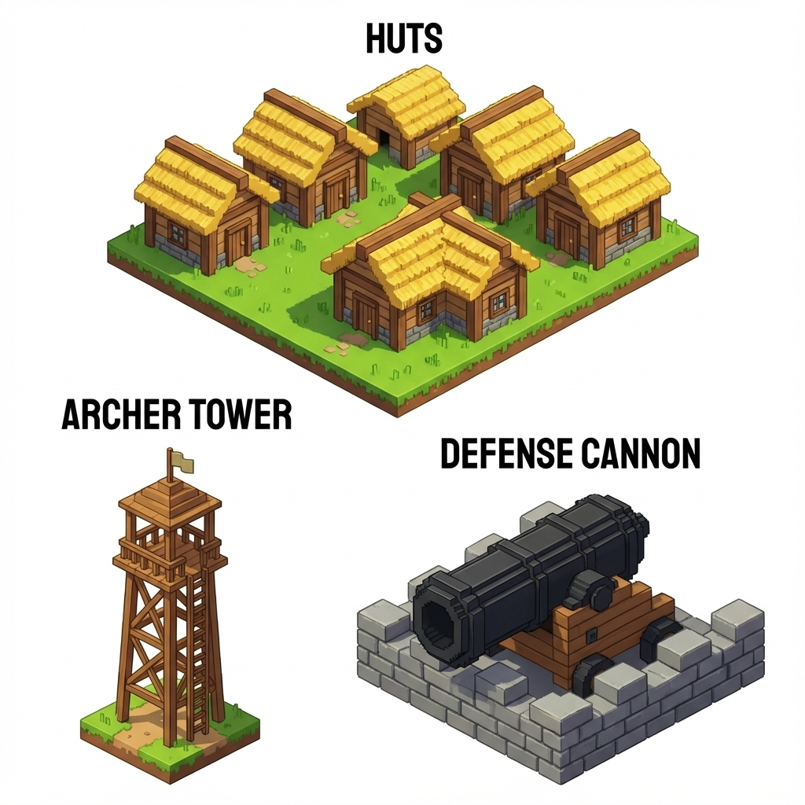

# 🎨 Clash of Pirates: Visual Design & Assets

> **Concept Art & Visual Reference Guide**
> *Style:* Voxel / Cubescape (Inspired by "Isle of Elara").
> *Engine:* Custom C Console Engine.

---

## 📸 Generated Concept Art
This section contains the official visual references generated for the project.
All images are located in the `assets/` folder.

### 1. Environment & Nature
**Biomes:** Water, Grass, Green Forest, Red Forest (Hardwood), Orange Forest (Autumn).

### 2. Units (Military & Civil)
**Key Characters:** MegaKnight, Villager, Archer, Raider, Constructor, Guard, Knight, Cannoneer.

### 3. The Navy
**Ships:** Scout Boat, Tactical Ship, Armored Dreadnought.

### 4. Buildings & Defenses
**Structures:** Fortress, Elixir Factory, Mortar, Dock, Huts, Towers, Cannons.

---

## 📝 Detailed Asset Descriptions
For assets not yet imaged, we follow this strict Voxel aesthetic:

### Camp & Storage
*   **Camp:** Circle of white triangular tents around a lively orange voxel bonfire.
*   **Gold Storage:** Stone vault with steel corners and a visible pile of gold coins inside.
*   **Wood Storage:** Open shed with neatly stacked brown logs.
*   **Rock Storage:** Fenced corral filled with grey quarry blocks.
*   **Food Silo:** Tall red cylindrical tower with a white conical roof.
*   **Elixir Tank:** Giant glass spheres held by metal claws, glowing violet.
*   **Walls:** Dark grey stone blocks with battlements, connecting seamlessly.

### Resources & Extras
*   **Rocks:** Mossy grey boulders with iron veins.
*   **Crops:** Dark brown tilled soil patches with yellow wheat or orange carrots.
*   **Farm Animals:**
    *   *Cow:* White blocky cow with black spots.
    *   *Pig:* Small pink cube with a snout.
*   **Hunter:** Villager in grey wolf furs carrying a simple bow.
*   **Miner:** Villager with a yellow hard hat, candle, and soot on face.

---

## 🎨 Color Palette & Style
*   **Water:** Deep Blue `#006994` + White Foam.
*   **Grass:** Lime Green `#7CFC00`.
*   **Wood:** Chocolate Brown `#8B4513`.
*   **Stone:** Slate Grey `#708090`.
*   **Elixir:** Neon Purple `#9400D3`.

*All assets are designed to be rendered in an isometric grid or projected in the console engine.*
