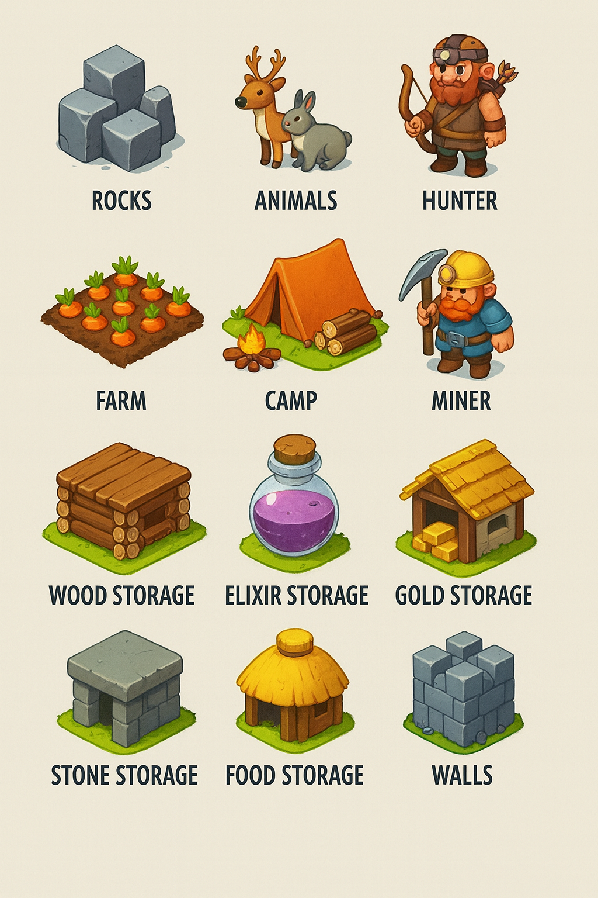

# Catálogo Visual: "Clash of Pirates - Voxel Style"

Este documento define la estética gráfica del juego, inspirada en "Isle of Elara" (Estilo Cubescape/Voxel).
*Referencia:* Estilo cúbico, Basado en el arte conceptual "Isle of Elara" (Estilo Cubescape).

## Referencia Visual Generada
Aquí tienes el aspecto gráfico oficial del juego (Concept Art), cubriendo TODOS los objetos.

### 1. Entorno y Naturaleza
*(Agua, Pasto, Árbol Verde, Árbol Rojo, Árbol Naranja)*

### 2. Unidades Militares y Civiles
*(Constructor, Guardia, Caballero, Cañonero)*

*(MegaCaballero, Aldeano, Arquera, Saqueador)*

### 3. Flota Naval
*(Bote Explorador, Barco Táctico, Acorazado)*

### 4. Edificios y Defensas
*(Chozas, Torre de Arqueras, Cañón Defensivo)*

*(Fortaleza, Fábrica de Elixir, Mortero, Muelle)*

### 5. Almacenamiento y Logística (Visuales Detallados)
*   **Campamento:**
    *   *Visual:* Un círculo de carpas triangulares blancas alrededor de una gran hoguera animada (vóxeles naranjas/amarillos).
*   **Almacén de Oro:**
    *   *Visual:* Una bóveda cúbica de piedra reforzada con esquinas de acero. La puerta es una rueda de banco. Montañas de monedas doradas brillantes se ven por las rejas.
*   **Almacén de Madera:**
    *   *Visual:* Un cobertizo techado pero sin paredes. Tiene pilas ordenadas de troncos marrones y tablones procesados.
*   **Almacén de Roca:**
    *   *Visual:* Un corral cercado con vallas de madera pesada, lleno de rocas grises de diferentes tamaños y bloques de cantera tallados.
*   **Almacén de Comida (Silo):**
    *   *Visual:* Una torre cilíndrica roja con techo cónico blanco. Tiene ventanas pequeñas por donde se ve el trigo o maíz.
*   **Almacén de Elixir:**
    *   *Visual:* Esferas de cristal gigante sostenidas por soportes de metal. Dentro brilla el líquido violeta pulsante.
*   **Murallas:**
    *   *Visual:* Bloques sólidos de piedra gris oscuro con almenas en la parte superior. Se conectan automáticamente.

### 6. Recursos, Vida Civil y Naturaleza
*   **Rocas (Naturales):**
    *   *Visual:* Formaciones de piedra gris con musgo verde en la parte superior. Algunas tienen vetas brillantes de hierro.
*   **Cultivos:**
    *   *Visual:* Cuadrados de tierra arada (marrón oscuro).
    *   *Trigo:* Vóxeles amarillos altos.
    *   *Zanahorias:* Puntos naranjas con hojas verdes.
*   **Animales de Granja:**
    *   *Vaca:* Voxel blanco con manchas negras geométricas. Cabeza grande.
    *   *Cerdo:* Cubo rosa con nariz de porcino más oscuro.
*   **Cazador (Unidad):**
    *   *Visual:* Viste pieles de lobo (gris/blanco). Lleva un arco simple a la espalda y un cuchillo en el cinto.
    
*   **Lobos (Fauna Salvaje):**
    *   *Visual:* Criaturas hostiles que habitan los bosques.
    
*   **Minero (Unidad):**
    *   *Visual:* Chaleco naranja de seguridad, casco amarillo con una vela encendida encima. Cara manchada de hollín. Lleva un pico de hierro.

### 7. Recursos Adicionales

## 1. Paleta de Colores y Terreno
*   **Agua:** Bloques de color azul profundo (`#006994`) con bordes más claros para la espuma.
*   **Pasto:** Verde lima vibrante (`#7CFC00`).
*   **Árboles:**
    *   *Verde:* Copas esféricas hechas de vóxeles.
    *   *Rojo:* Árboles de madera dura (Resource Zone), color carmesí.
    *   *Naranja:* Árboles de otoño para decorar.

## 2. Personajes (Unidades)
Todos los personajes tienen estética "Chibi" o "Blocky" (cabezas cuadradas, cuerpos compactos).

### Civiles
*   **Aldeano:** Cubo pequeño con camisa blanca y sombrero de paja amarillo. Lleva un pico o hacha en la mano.
*   **Constructor:** Casco amarillo de obra (estilo medieval) y mochila con planos.

### Militares de Tierra
*   **Guardia:**
    *   Armadura: Gris plateado, bloques simples.
    *   Escudo: Cuadrado con el emblema de la facción (Azul/Rojo).
*   **Caballero:**
    *   Montura: Un caballo cúbico marrón.
    *   Arma: Lanza larga de vóxeles.
    *   Plumaje: Casco con plumas azules.
*   **Saqueador:**
    *   Ropa oscura/negra, pañuelo rojo en la cabeza.
    *   Saco de monedas en la espalda.
*   **Arquera:**
    *   Traje verde/marrón (camuflaje). Gorro con pluma.
    *   Arco de madera simple.
*   **Cañonero:**
    *   Lleva un cañón negro enorme al hombro (casi de su mismo tamaño).
*   **MegaCaballero (Jefe):**
    *   **Tamaño:** Doble de grande que un aldeano (2x2 bloques).
    *   **Aspecto:** Armadura negra completa con pinchos. Dos mazas con bolas de pinchos en las manos. Ojos brillantes rojos.

## 3. Flota Naval
Los barcos parecen juguetes de madera flotantes.
*   **Bote Explorador:** Una cáscara de nuez cuadrada con una vela blanca triangular.
*   **Barco Táctico:** Casco alargado, dos velas cuadradas. Tiene balistas en los lados.
*   **Acorazado:**
    *   Casco de metal (gris).
    *   Tres chimeneas de vapor.
    *   Cañones laterales visibles.

## 4. Edificios
*   **Fortaleza:** Castillo central de piedra blanca con techo azul. Banderas ondeando. Se ve sólido e inamovible.
*   **Muelle:** Tablones de madera que se adentran en el bloque de agua.
*   **Chozas:** Cubos de madera con techos de paja (amarillos).
*   **Fábrica de Elixir:**
    *   Parece un laboratorio de alquimia cúbico.
    *   Tiene tubos de cristal con líquido violeta brillante (Elixir) fluyendo.
*   **Torre de Arqueras:** Alta y delgada, de madera.
*   **Mortero:** Base de piedra baja con un tubo grueso apuntando al cielo.
